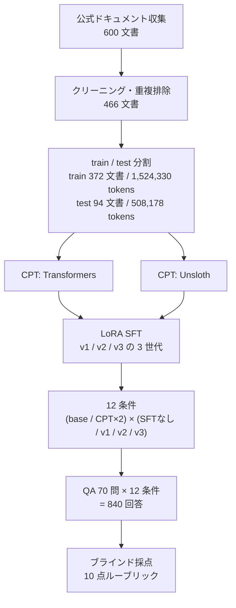

# 継続事前学習（CPT）と事後学習（SFT）を Qwen3-0.6B でやってみた — Qwen が知らない Claude Code と Codex の質問に答えられる LLM を作る

## はじめに

素の Qwen3-0.6B に「Claude Code で Git worktree を使ったセッションを開くには？」と聞くと、`claudacode` という存在しないコマンドを返してきます。学習データにその知識が無いからです。

そこに公式ドキュメント約 152 万トークンを継続事前学習（CPT）で流し込むと、**RTX 4070 1 枚・約 5 分の学習**で `claude --worktree` と正しく答えるようになりました。10 点満点の自動採点で **+1.00 点**（95%信頼区間 [+0.20, +1.90]）の改善です。

なぜモデル本体に知識を入れるのか。そしてなぜ、いちばん小さい 0.6B から始めたのか。この記事の出発点はここにあります。

**フロンティアモデルは今後さらに高くなります。** 誰もが自由に使える前提は、コストと電力の面で崩れていきます。加えて、汎用の賢いモデルは賢すぎるがゆえに、自社の業務にとっては「知らなくていいこと」まで大量に抱えています。その巨大な知識のほとんどを使わないまま、毎回の推論コストだけを払い続けることになります。

**私が今後ほしいのは、いちばん賢いモデルではなく、自分たちで管理できるサイズのモデルです。** 重みが手元にあり、中身を自分の用途に合わせて作り替えられて、社外にデータを出さずに回せる。そのサイズは 0.6B ではなく、おそらく**ローカルで動かせる 10B〜30B 程度**でしょう。そこに自社ドキュメントを継続事前学習（CPT）と事後学習（SFT）で入れてしまえば、**電力・経済性・セキュリティのどれを取っても、巨大な汎用モデルに毎回問い合わせるより有利になるはず**です。

ただし、それをいきなり 30B で試すのは高くつきます。**先に確かめるべきは「そもそも独自知識はモデルに入るのか」で、これはいちばん小さいモデルで測るのが安い。** だから 0.6B から始めました。RTX 4070 1 枚・5 分で 1 サイクル回るので、失敗しても損失がありません。

これまでこのブログでは、[RAG が外したときにしれっと嘘をつく様子](https://qiita.com/Marron-chan/items/8b3a1febb516dc93bbd2)や、[全文をプロンプトに固定する CAG](https://qiita.com/Marron-chan/items/d5fba42cacc95540c884)（[結果編](https://qiita.com/Marron-chan/items/77d0892c4d19930bd455)）、[KV キャッシュを CPU に逃がす運用](https://qiita.com/Marron-chan/items/4ce9777adb46a8af89a0)まで、**推論側**をひたすら測ってきました。今回は初めて**学習側**に踏み込みます。

対象読者は、手元の GPU でドメイン特化モデルを作れるか知りたい人、RAG を組んだが運用が重いと感じている人、そして社外にデータを出せない前提で LLM を使いたい人です。前提知識は、LoRA と RAG の概要が分かる程度で十分です。

先に正直に書いておくと、**今回測ったのは「知識が入るか」だけです。** 電力効率もコストもプロンプト長も測っていませんし、10B〜30B での検証もしていません。冒頭に書いた優位性は、この実験で示した結論ではなく、これから確かめにいく仮説です。

## 要点

- 公式ドキュメント 600 文書を収集・整形し、**約 152 万トークン**を Qwen3-0.6B-Base に継続事前学習。さらに LoRA による事後学習（SFT）を 3 世代分作り、**12 条件 × 70 問 = 840 回答**を突き合わせました。
- **知識は入りました。** Claude Code ドメインで **+1.00 点**（95%CI [+0.20, +1.90]）。存在しないコマンドを作っていたモデルが、正しいフラグを答えるようになります。
- **一方、Codex ドメインでは効果がゼロでした**（±0.00、95%CI [−0.80, +0.80]）。同じパイプライン・同じ設定で、ドメインだけが違います。
- 原因を追ったところ、学習コーパスの **19.2% が評価と無関係な OpenAI Platform API のドキュメント**でした。**文書数では気づけず、実トークンで数え直して初めて**判明しました。
- 採点は**独立した 2 つの判定モデル**で行い、840 スコアの相関 **r = 0.87**、有意判定は **25 件中 24 件が一致**しました。以下の数値と、それを再生成するスクリプトはすべて公開しています。
- 個人規模の CPT で知識注入は成立します。ただし成否を決めていたのは学習設定ではなく、**データセットの中身を正しく数えられていたか**でした。
- 0.6B は入り口としては十分機能しましたが、**正しい知識のすぐ隣に創作が混ざります**。実運用に載せるなら、もう一段大きいサイズが要るというのが今回の実感です。

## なぜ RAG ではなく、モデルに知識を入れるのか

知識をモデルに与える方法は、大きく 3 つあります。このブログで順に試してきたので、実測値つきで並べます。

| 方式 | 知識の置き場所 | 実測して分かったこと |
|---|---|---|
| **RAG** | 外部の検索インデックス | 検索が当たれば正答。**外すと、ありもしない設定をでっち上げる** |
| **CAG** | プロンプトの先頭に全文固定 | 精度は上がる（2.00 点満点で RAG 1.58 → CAG 1.90）。ただし**プロンプトが 6.4 倍**（393 → 2,529 トークン） |
| **CPT / SFT** | **モデルの重み** | 今回検証 |

RAG は外部注入なので、検索が外した瞬間に破綻します。CAG は取りこぼしを潰せますが、毎回の入力に資料全文を積むぶんプロンプトが膨らみます。

**モデル自身が知識を持っていれば、入力は質問文だけで済みます。** 資料を毎回積む必要も、検索が当たるか祈る必要もありません。しかも重みが手元にあるので、資料そのものが社外に出ません。RAG も CAG も、ホスト型 API と組み合わせる限り、毎回の推論で社内文書を外へ送り続けることになります。

自分たちで管理できるサイズのモデルに必要な知識だけを入れておけば、巨大な汎用モデルに毎回長いプロンプトを投げるより、**電力・経済性・セキュリティのすべてで有利になるはず**です。

ここまでが**仮説**です。成り立つ前提として、まず「独自知識が本当にモデルに入るのか」を確かめる必要があります。それが今回の検証範囲で、それをいちばん安く測れるのが 0.6B でした。

## 何を作ったか

個人環境で、収集から採点まで一通り組みました。



規模と、各段階で下した判断です。

| 段階 | 規模 | 判断したこと |
|---|---|---|
| 収集 | 600 文書 | Claude Code と Codex の公式ドキュメントに限定 |
| 整形 | 466 文書（134 件除外） | canonical URL 重複 111 件、短すぎる断片 18 件などを除外 |
| 分割 | train 372 / test 94 文書 | canonical URL の重複ゼロを確認して分割 |
| CPT | 1,524,330 トークン | 2 フレームワークで同一データ・同一設定を実行 |
| SFT | LoRA アダプター 9 本 | 回答形式を変えた 3 世代 × 3 ベースモデル |
| 評価 | 70 問 | 全設問に**出典 URL・本文の SHA-256・根拠抜粋**を記録 |
| 採点 | 840 回答 | モデル名を伏せ、候補順を設問ごとに変更 |

評価の 70 問は、性格の違う 2 つに分けています。ここを混ぜると、後で結論を読み違えます。

| split | 問題数 | 内訳 | 役割 |
|---|---:|---|---|
| `sft_seen` | 30 | Claude 15 / Codex 15 | SFT に直接収録した知識。**暗記の対照群** |
| `heldout` | 40 | Claude 20 / Codex 20 | SFT 未収録。**CPT 知識の主評価** |

採点の設計で 1 つ効いたことがあります。同一設問は同一の採点者が 12 条件すべてを見ています。採点者ごとに平均 2.35 点 vs 3.34 点という無視できない甘辛の差がありましたが、この設計のおかげで**同一設問内での条件間の差は、甘辛の影響を受けません**。絶対点の水平比較だけを避ければ済みます。

さらに、**840 回答すべてを独立した 2 つの判定モデルで採点しました。** 一方は 3 体に分担させたエージェント、もう一方は `gemini-3.5-flash-lite` で、互いのスコアは見せていません。結果は **相関 r = 0.87**、有意判定は **25 件中 24 件が一致**しました。以降に出す数値は、片方の判定モデルの気分で決まったものではありません。

唯一割れたのは heldout 40 問の CPT 効果です（+0.500 [−0.100, +1.125] と +0.625 [+0.025, +1.250]）。ただし後述する**ドメイン別の判定は両者で完全に一致**しており、記事の結論に影響しません。

## 検証環境

```text
- ハードウェア: NVIDIA GeForce RTX 4070 (12,282 MiB / 実効 11,864 MiB)
- OS / ドライバ: Ubuntu (Linux 7.0.0-28-generic), NVIDIA driver 580.126.20, CUDA 12.8
- Python: 3.12.3
- 主要パッケージ: torch 2.11.0+cu128, transformers 5.15.0, peft 0.20.0, bitsandbytes 0.50.1
- モデル: Qwen/Qwen3-0.6B-Base (revision da87bfb608c14b7cf20ba1ce41287e8de496c0cd)
```

CPT はパラメータを fp32 で保持し、計算を bf16、gradient checkpointing 有効で回しました。

| 項目 | 値 | 選んだ理由 |
|---|---|---|
| sequence_length | 1024 | 12GB に収め、パッキング効率を優先 |
| micro_batch / grad_accum | 1 / 16（実効 16） | VRAM 制約。ピーク 8,474 MiB に収まる |
| learning_rate | 1e-5, constant, warmup なし | 既存能力を壊さない保守側に振る |
| optimizer | adamw_8bit (β=0.9/0.95, wd=0.1) | オプティマイザ状態の VRAM 削減 |
| epochs / seed | 1 / 20260815 | 単一 seed（後述の補足を参照） |

学習は 1 回あたり **約 306 秒（4,981 token/s）**で終わります。held-out loss は **2.5403 → 2.1456** に下がりました。

SFT 側は LoRA（r=16, alpha=32, dropout=0.05, 対象 `q/k/v/o/gate/up/down_proj`）を lr=2e-4・3 epochs で、200 件のデータセットに対して回しています。

## CPT で知識は入ったか

入りました。冒頭の質問への回答が、こう変わります。

```text
【CPT 前】
To start an isolated Claude Code session in a named Git worktree, navigate to
the worktree directory and run the following command: `cd <worktree_name> && claudacode`.

【CPT 後】
To start an isolated Claude Code session in a named Git worktree, use the
`claude --worktree` flag with the worktree name. For example,
`claude --worktree my-worktree` starts a session in the `my-worktree` worktree.
```

存在しないコマンドが、正しいフラグと使用例に変わりました。**152 万トークン・5 分の学習で、0.6B のモデルはここまで動きます。**

ひとつ観察を添えると、CPT 後のこの回答には続きがあり、モデルは対応バージョンを 1 つ挙げていました。出典にその記述はありません。**正しい知識と創作が隣り合って出てきます。** 小型モデルに知識を入れる際に、この性質は押さえておく価値があります。

## 総合順位表をやめた理由

12 条件の平均点を並べた総合順位表を最初に作りましたが、**これは捨てました。** 上位が 3.3〜3.4 点に密集していて、どれが本物の差なのか判別できなかったからです。840 スコアの分布を見ると過半数が 2 点以下で、上位群は「どれも当たっていない中での僅差」でした。

代わりに、**同一設問での対応あり比較**に切り替え、リサンプリング 20,000 回のブートストラップで信頼区間を出しました。設問ごとの難易度差と採点者の甘辛が相殺され、条件間の差だけが残ります。

この切り替えで、**「効果がない」と「測れなかった」を分けて書けるようになりました。** 今回のように 40 問・単一 seed の規模では、±0.6 点未満の効果はそもそも検出できません。観測値がマイナスでも、それが劣化なのか誤差なのかは区別できないということです。

## 効いたドメインと、効かなかったドメイン

信頼区間で見ると、結果はきれいに割れました。

| 比較 | 範囲 | Δ平均 | 95%CI | 判定 |
|---|---|---:|---|---|
| base → CPT | 全 70 問 | **+0.80** | [+0.27, +1.37] | 有意 |
| base → CPT | heldout Claude 20 問 | **+1.00** | [+0.20, +1.90] | 有意 |
| base → CPT | heldout Codex 20 問 | **±0.00** | [−0.80, +0.80] | 効果なし |
| CPT → +SFT | heldout 40 問 | −0.20 | [−0.83, +0.43] | 測れず |
| base → SFT | `sft_seen` 30 問 | **+1.77** | [+0.67, +2.97] | 有意 |

3 点あります。

**CPT による知識獲得は Claude Code 側で成立しています。** これが今回の主成果です。

**Codex 側は効果がゼロです。** 同じパイプライン、同じ学習設定、同じ評価、同じ採点者。違うのはドメインだけです。

**SFT は「収録した知識」と「未収録の知識」で挙動が全く違います。** 直接収録した 30 問では +1.77 点と明確に暗記していますが、未収録の 40 問では信頼区間が [−0.83, +0.43] と広く、効果があるともないとも言えません。ここは「劣化した」ではなく「測れなかった」が正確です。

では、なぜ Codex だけ効かなかったのか。仮説を 3 つ立てて順に潰しました。

## 原因を 3 つの仮説で切り分ける

### 仮説1：重要な単語の出現回数が足りない？

一番ありそうな仮説です。heldout 40 問について、正解キーワードが学習コーパスに何回出現するかを数え、CPT 後のスコアと突き合わせました。

```text
相関(log 最小出現回数, CPTスコア) = -0.139
相関(log 総出現回数,   CPTスコア) = +0.065
```

| 最小出現回数 | 問題数 | base 平均 | CPT 平均 | 差 |
|---|---:|---:|---:|---:|
| 0 回（未出現） | 4 | 1.25 | 3.50 | +2.25 |
| 1〜4 回 | 18 | 3.33 | 3.78 | +0.44 |
| 5〜19 回 | 7 | 2.71 | 2.43 | −0.29 |
| 20 回以上 | 11 | 2.55 | 3.00 | +0.45 |

**相関はほぼゼロでした。** 個別に見るともっと極端です。

- `~/.codex/rules` … コーパスに **1 回**しか出ないのに正答
- `SKILL.md` … **132 回**出現して不正答
- `--profile` … 10 回出現、base の 4 点から CPT で **0 点に低下**

**同じ文字列を何度も見せることは、この規模では効いていません。** 仮説1は却下です。

### 仮説2：Codex 側のデータが重複だらけ？

次に重複を疑いました。同じ内容が混ざっていて、実質的な情報量が少ないのではないか。

| 指標 | Claude Code | Codex |
|---|---:|---:|
| 近似重複文書ペア（8-gram Jaccard ≥ 0.3） | **0 件** | **0 件** |
| ユニーク 8-gram 率 | 97.7% | **97.9%** |
| 実質行（20 字以上）のユニーク率 | 85.5% | **88.5%** |

**重複はほぼ差がなく、むしろ Codex 側のほうがきれいでした。** 仮説2も却下です。

ここで 1 つ引っかかりました。単純な行単位で数えると Codex 35.5% / Claude 24.7% と、Codex の重複が多く見えていたのです。中身を確認すると ` ``` ` `{` `}` でした。Codex のドキュメントはコード例と JSON の比率が高いだけです。**20 字以上の実質行に絞ると、評価が逆転します。**

集計単位を変えると結論が反転する。この経験が、次の一手につながりました。

### 仮説3：評価問題そのものを検証する

原因がデータ側にありそうだと当たりをつけて、まず**評価問題が信用できるか**を確かめました。70 問の出典 URL を、学習に使った train 分割と、使っていない test 分割に照合します。

```text
出典が train にある : 37 URL
出典が test  にある :  4 URL  ← モデルは一度も学習していない
コーパスに存在しない :  1 URL
```

**heldout 40 問のうち 4 問は、モデルが学習していない文書を出典にしていました。** しかもこの 4 問、CPT 後の伸びが **+2.25 点**と全体の +0.50 点を大きく上回っています。学習していない文書の問題で最も伸びている以上、測っていたものの一部は事実の想起ではなく、**ドキュメント調のスタイル適応**（それらしい形のフラグ名やパス名を作る能力）です。

この 4 問を除いて測り直すと、こうなりました。

| 範囲 | 従来 | 4 問除外後 |
|---|---|---|
| heldout Claude | +1.000 [+0.20, +1.90] (20 問) | **+1.000** [+0.11, +2.00] (18 問) |
| heldout Codex | ±0.000 [−0.80, +0.80] (20 問) | **−0.389** [−1.11, +0.22] (18 問) |

Claude 側の結論は動きません。**評価データの照合は、CPT のような実験では毎回入れる価値があります。** 出典が train に入っているかを機械的に突き合わせるだけで、数分で終わります。

ただし、これは評価の精度が上がっただけで、非対称の原因ではありません。

## 実トークンで数え直したら、19.2% が無関係だった

最後に、データセットそのものを**文書数ではなく実トークン数**で数え直しました。ここで出ました。

| 分類 | 文書数 | トークン | 全体比 | 70 問の評価対象か |
|---|---:|---:|---:|---|
| Claude Code docs | 160 | **964,056** | 63.2% | ○（Claude 20 問） |
| Codex CLI docs | 111 | **267,107** | 17.5% | ○（Codex 20 問） |
| OpenAI Platform API docs | 101 | **293,167** | 19.2% | **× 無関係** |

収集時にドメイン単位で「Claude 側」「Codex 側」と分けていたのですが、Codex 側として集めた文書に API プラットフォームのドキュメント 91 件が混ざっていました。中身はこれです。

```text
structured-outputs / function-calling / embeddings / text-to-speech
video-generation / images-vision / moderation / realtime-translation
supervised-fine-tuning / prompt-caching / token-counting / retrieval ...
```

Codex CLI とは何の関係もありません。**Codex CLI 本体（267k トークン）より、この無関係な文書（293k トークン）のほうが多い**状態でした。

実効的な比率はこうなります。

> **Claude Code : Codex CLI = 964,056 : 267,107 = 3.61 : 1**

ドメイン単位で見えていた 1.7 倍差ではなく、**実質 3.6 倍差**です。しかも**文書数だけは Codex 側のほうが多い**（211 vs 160）ため、集計表を眺めている限り「Codex も十分ある」ように見えていました。

設問あたりに直すと、差は一貫します。

| | 対象トークン | heldout 設問数 | 1 問あたり | 出典文書サイズ中央値 |
|---|---:|---:|---:|---:|
| Claude Code | 964,056 | 20 | **48,203** | 32,150 字 |
| Codex CLI | 267,107 | 20 | **13,355** | 11,023 字 |

総量・設問あたり・出典文書サイズの 3 つの水準すべてで、約 3 倍の差が揃いました。**Claude +1.00 / Codex ±0.00 という非対称は、これで説明がつきます。**

なお、この無関係な文書が回答を汚染しているかも確認しましたが、OpenAI API 由来の語彙の混入は base 2/20・CPT 2/20 で差がありませんでした。**干渉ではなく、学習予算の浪費**です。「重複」ではなく「希釈」が起きていました。

## やってみて分かったこと

**独自知識をモデルに入れること自体は、個人環境でも成立します。** RTX 4070 1 枚・5 分の学習で、存在しないコマンドを作っていた 0.6B モデルが正しいフラグを答えるようになりました。ローカルで完結するので、社内ドキュメントを外に出さずに同じことができます。入り口の問い「そもそも入るのか」への答えは、入る、です。

**同時に、0.6B の天井も見えました。** 正しいフラグを答えた直後に、出典に無いバージョン番号を作る。`~/.codex/rules` は当てるのに `prefix_rule()` は出てこない。知識が「入った」のではなく「うっすら入った」状態で、その薄さを埋めるようにモデルが創作します。この挙動は、業務で使う回答としては採用できません。

だから冒頭に書いたとおり、**本命は 0.6B ではありません。** 重みを手元に置けて、社外にデータを出さずに回せて、なおかつ薄い知識を創作で埋めずに済む容量がある——その交点はおそらく **10B〜30B** のあたりです。今回はそこへ進む前に、いちばん安いサイズで手順とデータの作り方を確かめた、という位置づけになります。

そのうえで、実際に手を動かして得た教訓は 3 つです。

**1. データセットは文書数ではなく実トークンで数える。** 文書数では Codex 側のほうが多く見えていました。19.2% の混入は、実トークンで数えるまで一度も表面化しませんでした。成否を分けたのは学習設定ではなく、データの数え方でした。

**2. 集計単位を変えて 2 回数える。** 行単位の重複率は、trivial な行を含めるかどうかで Claude / Codex の優劣が反転しました。1 つの数字だけを見ていたら、逆の結論を書いていました。

**3. 順位表ではなく信頼区間を出す。** 総合順位では 3.3〜3.4 点の団子でしたが、対応あり比較にすると「Claude で有意・Codex でゼロ」という構造が見えました。「効果がなかった」と「測れなかった」を分けて書けたのは、信頼区間を出したからです。

そして、**同じ文字列を繰り返し見せても効きませんでした**（相関 −0.14）。効いていたのは反復回数ではなく、その事実が置かれた文脈の総量です。Claude Code は 1 文書 3.2 万字あり各事実が豊かな文脈に埋まっているのに対し、Codex CLI は 1.1 万字しかありませんでした。自分の用途にモデルを作り替えるなら、同じ文を増やすより、**同じ事実を違う文脈で見せる**方向に投資すべきだと考えています。この教訓はサイズが変わっても効くはずです。

次に試すのは、混入していた API ドキュメント 101 文書（293k トークン）を除外しての再学習です。学習予算の 19.2% が空きます。これで Codex 側の効果が正に転じれば「量と希釈が原因」が確定します。フィルタを 1 つ足すだけで、新規のデータ収集なしに実行できます。

そのうえで本題の **10B〜30B** に上げ、冒頭で仮説として置いた 3 つを実測したいと考えています。知識をモデルに持たせた場合、RAG や CAG と比べて**入力トークンがどれだけ減るのか**（経済性）、**1 回答あたりの消費電力がどう変わるのか**（電力）、そして**社外に何も送らない構成で業務に耐える精度が出るのか**（セキュリティ）。ここまで測れて、はじめて「管理できるサイズに寄せる」ことの損得が言えます。

:::note info
**補足：この実験で言えないこと**

- **ドメイン間比較は n=2 です。** トピックの難易度、文書の書き方、ベースモデルの事前知識（base 素点は Claude 3.20 / Codex 2.40）といった交絡が残ります。有力な説明であって、証明された原因ではありません。
- **単一 seed・1 epoch です。** 学習の分散を評価していないため、条件間の小さな差は seed 由来かもしれません。
- **採点の絶対点は低く**（840 スコアの過半数が 2 点以下）、上位群の 0.1 点差には意味がありません。本文で使ったのは対応あり比較の差だけです。
- **70 問・単一ルーブリック**のため、±0.6 点未満の効果は検出できません。
- **電力・コスト・プロンプト長は未計測**です。冒頭に書いた電力・経済性・セキュリティの優位性は動機であり、本記事の実測結果ではありません。
- **検証したのは 0.6B のみ**です。本命として挙げた 10B〜30B での知識注入は試していません。そのサイズ帯の見立ては、0.6B で見えた創作の混ざり方からの推測です。
:::

## 検証データを公開しています

記事中の数値は、すべて再生成できる形で置いてあります。

**リポジトリ: https://github.com/ai-systems-notes/CPT_SFT**

入っているものは次のとおりです。

- **70 問の評価セット** — 各設問に出典 URL、出典本文の SHA-256、根拠抜粋
- **840 回答** — 12 条件 × 70 問、すべて同一プロンプト・同一生成設定
- **2 つの判定モデルの生スコア** — 集計後ではなく設問ごとの素点
- **解析結果** — 対応あり効果、判定者間一致、コーパス構成、重複、出現回数と正答の相関、出典の照合結果
- **収集から学習・評価までの全スクリプト**

```bash
python3 cpt_training/scripts/analyze_blog_claims.py
```

これで記事中の数値がそのまま再生成されます。ブートストラップは seed 固定なので、信頼区間まで一致します。

**公式ドキュメントの本文そのものは置いていません。** スクレイピングしたページは各社のものなので再配布しない、という判断です。かわりに、収集スクリプトと前処理スクリプトを公開しているので、同じコーパスは手元で再生成できます。

```bash
python3 ai_coding_agent_cpt_data/scripts/scrape_docs_spider.py
python3 ai_coding_agent_cpt_data/scripts/preprocess_cpt_data.py
```

本文が無くても検証は成立します。全設問が**出典 URL と本文の SHA-256** を持っているので、読者が自分でページを取得すれば、参照解答が本当にその文書に書いてあるかを独立に確認できます。コーパスの実トークン数や重複率といった派生統計も、集計後の値を JSON に残してあります。

## おわりに

フロンティアモデルを追いかけ続ける以外に、**自分たちで管理できるサイズのモデルを、自分たちの用途に作り替える**という道があります。重みが手元にあり、社外にデータを出さず、必要な知識だけを内側に持つ。電力でも、経済性でも、セキュリティでも、この方向は今後効いてくると考えています。

今回はその一番手前、**独自知識が本当にモデルに入るのか**を、いちばん安いサイズで測りました。答えは「入る。ただしデータの数え方を間違えると、入れたつもりで学習予算の 2 割を捨てる」でした。そして 0.6B では、入った知識の薄いところをモデルが創作で埋めます。次は 10B〜30B です。

**同じことを考えている方、社内で検討している方がいれば、ぜひコメントで教えてください。** うまくいった条件も、うまくいかなかった条件も知りたいです。どのサイズ帯を選んだか、どんなデータの作り方をしたか、そのあたりの実例が一番ほしいところです。続編では、API ドキュメント除外後の再学習と、10B〜30B での電力・トークン・精度の実測を予定しています。

## 参考

- Qwen3-0.6B-Base: https://huggingface.co/Qwen/Qwen3-0.6B-Base
- LoRA: Low-Rank Adaptation of Large Language Models (Hu et al., 2021): https://arxiv.org/abs/2106.09685
- Hugging Face PEFT: https://huggingface.co/docs/peft
- Hugging Face Transformers: https://huggingface.co/docs/transformers
- Unsloth: https://github.com/unslothai/unsloth
